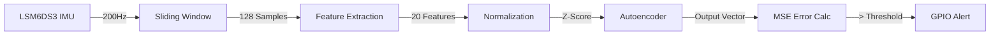

# 🏗️ Architecture

VibeSentinel is built using a modular Rust workspace architecture, ensuring strict separation between feature extraction, model definition, training logic, and hardware-specific firmware.

## 📦 Component Breakdown

### 1. `vibesentinel-features` (`no_std`)
The DSP (Digital Signal Processing) core.
*   **Windowing**: Manages 128-sample buffers for X, Y, Z axes.
*   **Time-Domain Stats**: RMS, Peak, Kurtosis (impulse detection), Crest Factor.
*   **Frequency-Domain**: FFT magnitude extraction using `microfft`.

### 2. `vibesentinel-model` (`no_std`)
The Neural Inference engine.
*   **Architecture**: Autoencoder (20 → 10 → 4 → 10 → 20).
*   **Normalization**: Z-score normalization with clipping, ensuring runtime inputs match training distribution.
*   **Weights**: Static compiled arrays generated by the trainer.

### 3. `vibesentinel-trainer` (`std`)
The ML pipeline.
*   **Backend**: Powered by `Burn` (NDArray).
*   **Calibration**: Automatically calculates the `ANOMALY_THRESHOLD` based on 3-sigma deviation of reconstruction error.
*   **Exporter**: Serializes weights into valid Rust code for the `model` crate.

### 4. `vibesentinel-firmware` (`esp-idf`)
The Embedded application.
*   **Drivers**: I2C driver for LSM6DS3/LIS3DH IMUs.
*   **Real-time Loop**: 200Hz sampling task managed by FreeRTOS.
*   **Signaling**: GPIO-based alert management.

## 🔄 Data Flow

